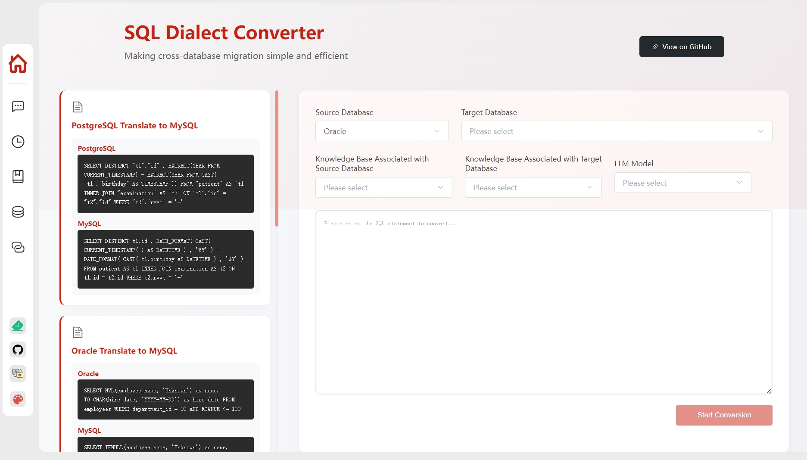
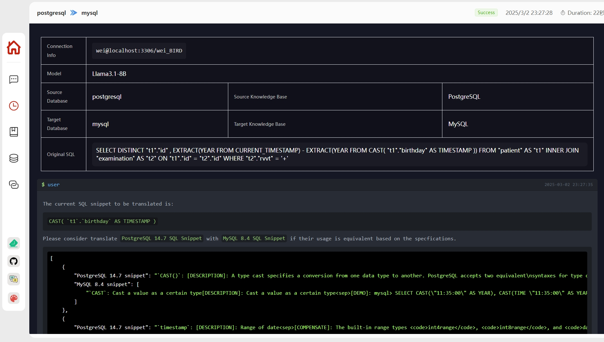
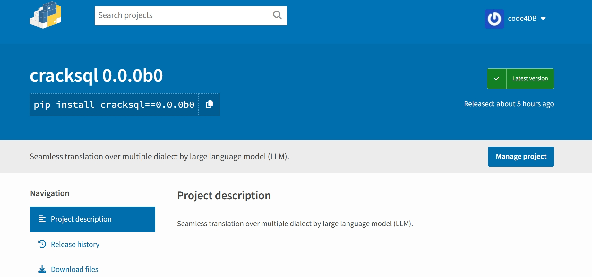

# CrackSQL

<p align="center">
  <b>📄 Unlock seamless SQL translation – effortless, precise, and efficient across databases~ 🐬</b>
</p>

<div align="center">
  
  <a></a>
  <a></a>
  <a></a>
  <a></a>

</div>

<p align="center">
  <a href="#-demo">Demo</a> •
  <a href="#-quick-start">Quick Start</a> •
  <a href="#-feature-extension">Feature Extension</a> • 
  <a href="#-faq">FAQ</a> •  
  <a href="#-community">Community</a> •  
  <a href="#-contributors">Contributors</a> •  
  <a href="#-license">License</a>
</p>

<p align="center">
  <b>English</b> | <a href="./README_ZH.md">简体中文</a>
</p>

<p align="center">
  <b>Star ⭐ and subscribe 🔔 for the latest features and improvements!</b>
</p>

## ✨ Project Introduction

CrackSQL is a powerful SQL dialect translation tool that integrates rule-based strategies with LLMs for high accuracy.
It enables seamless conversion between dialects (e.g., PostgreSQL → MySQL) with flexible access through Python API, command line, and web interface.

> - **03/2025:** We have refactored the code and released our project across multiple open-source platforms ([PyPI](https://pypi.org/project/cracksql/0.0.0b0/)). We are currently working on [new features](#todo) and more contributors are welcomed! :wave: 👫
> - **02/2025:** Our paper "*Cracking SQL Barrier: An LLM-based Dialect Translation System*" has been accepted by SIGMOD 2025! :tada: :tada: :tada:

## 📚 Features

- 🚀 **Extensive Dialect Compatibility**: Effortlessly translates between PostgreSQL, MySQL, and Oracle with tailored flexible strategies.
- 🎯 **Precision & Advanced Processing**: Achieves flawless translations with function-oriented query handling and cutting-edge model-based syntax matching through an adaptive local-to-global iteration strategy.
- 🔄 **Versatile Access & Integration**: Seamlessly integrates with Python API, command line, and web interface to meet all user requirements.

Currently, CrackSQL has integrated three modes for dialect translation, adopting the rules from [SQLGlot](https://sqlglot.com/sqlglot.html) and supporting a wide range of large language models (LLMs), 
including prevalent models like [GPT](https://openai.com/api/) as well as the recent [DeepSeek](https://huggingface.co/deepseek-ai/DeepSeek-R1).

<table><thead>
  <tr>
    <th rowspan="2">Mode</th>
    <th rowspan="2">SQL Dialect</th>
    <th colspan="2">LLM<br>(w/o &amp; w fine-tuned)</th>
    <th colspan="2">Embedding Model<br>(w/o &amp; w fine-tuned)</th>
  </tr>
  <tr>
    <th>Cloud Service<br>(e.g., <a href="https://openai.com/api/" target="_blank" rel="noopener noreferrer">💬 GPT series</a>)</th>
    <th>Local Deployed<br>(e.g., <a href="https://huggingface.co/" target="_blank" rel="noopener noreferrer">🤗 Hugging Face</a>)</th>
    <th>Cloud Service<br>(e.g., <a href="https://openai.com/api/" target="_blank" rel="noopener noreferrer">💬 GPT series</a>)</th>
    <th>Local Deployed<br>(e.g., <a href="https://huggingface.co/" target="_blank" rel="noopener noreferrer">🤗 Hugging Face</a>)</th>
  </tr></thead>
<tbody>
  <tr>
    <td>Rule-only</td>
    <td>24</td>
    <td>-</td>
    <td>-</td>
    <td>-</td>
    <td>-</td>
  </tr>
  <tr>
    <td>LLM-direct</td>
    <td>✅</td>
    <td>✅</td>
    <td>✅</td>
    <td>-</td>
    <td>-</td>
  </tr>
  <tr>
    <td>Rule+LLM</td>
    <td>3<br>(pg/mysql/oracle)</td>
    <td>✅</td>
    <td>✅</td>
    <td>✅</td>
    <td>✅</td>
  </tr>
</tbody></table>

Additionally, the prerequisites for each mode are listed below, where [*SQL Parser (ANTLR)*](./backend/preprocessor/antlr_parser) and [*Dialect Specification*](./data/processed_document) have already been provided. 
Please refer to [*Feature Extension*](#extension) section to customize and enhance CrackSQL to make it more powerful for your own cases.

<table><thead>
  <tr>
    <th rowspan="2">Mode</th>
    <th colspan="3">SQL Dialect</th>
    <th colspan="2">Model Service</th>
  </tr>
  <tr>
    <th>SQL Parser</th>
    <th>Dialect Specification</th>
    <th>Database Connection</th>
    <th>LLM</th>
    <th>Embedding Model</th>
  </tr></thead>
<tbody>
  <tr>
    <td>Rule-only</td>
    <td>✅<br>(SQLGlot)</td>
    <td>-</td>
    <td>-</td>
    <td>-</td>
    <td>-</td>
  </tr>
  <tr>
    <td>LLM-direct</td>
    <td>-</td>
    <td>-</td>
    <td>-</td>
    <td>✅</td>
    <td>-</td>
  </tr>
  <tr>
    <td>Rule+LLM</td>
    <td>✅<br>(ANTLR)</td>
    <td>✅</td>
    <td>✅ / -</td>
    <td>✅</td>
    <td>✅ / -</td>
  </tr>
</tbody>
</table>

## 📊 Performance

The following table demonstrates the translation accuracy (%) of different methods over our collected [benchmark](./data) (N/A denotes the dialect translation is not supported in Ora2Pg).
- (1) $Acc_{EX}$ indicates the translated SQL is syntactically correct and executable over the target database.
- (2) $Acc_{RES}$ represents the translated SQL delivers exactly the same result (including the displayed order) as the original ones.

Note that the required translation duration is highly dependent on the SQL complexity (e.g., the number of SQL syntax piece to be translated) and can vary from several seconds to minutes.

| **Method**                 | **PG → MySQL** | **MySQL → PG** | **PG → Oracle** | **Oracle → PG** | **MySQL → Oracle** | **Oracle → MySQL** |
|--------------------------------------------------|:---------------------------------------------------:|:---------------------------------------------------:|:----------------------------------------------------:|:----------------------------------------------------:|:-------------------------------------------------------:|:-------------------------------------------------------:|
|                                                  | **$Acc_{EX}$**                                 | **$Acc_{RES}$**                                | **$Acc_{EX}$**                                  | **$Acc_{RES}$**                                 | **$Acc_{EX}$**                                     | **$Acc_{RES}$**                                    |
| **SQLGlot**                  | 74.19                                               | 70.97                                               | 60.32                                                | 60.32                                                | 55.81                                                   | 53.49                                                   |
| **jOOQ**                          | 70.97                                               | 70.97                                               | 39.68                                                | 39.68                                                | 62.79                                                   | 60.47                                                   |
| **Ora2Pg** | N/A                                        | N/A                                        | 33.33                                     | 33.33                                     | N/A                                            | N/A                                            |
| **SQLines**                  | 9.68                                                | 9.68                                                | 31.75                                                | 31.75                                                | 53.49                                                   | 48.84                                                   |
| **GPT-4o**                     | 61.29                                               | 61.29                                               | 50.79                                                | 44.44                                                | 60.47                                                   | 55.81                                                   |
| **CrackSQL (Ours)**                          | **87.1**                                       | **74.19**                                      | **85.71**                                       | **79.37**                                       | **69.77**                                          | **67.44**                                          |

## 🖥️ Demo

The following showcases the primary pages of the CrackSQL interface service, including the service guidance homepage and detailed translation process.

- Homepage of the deployed translation service:



- Detailed translation process of specific translation pair:



## 🕹 Quick Start

We have currently offered two methods (i.e., PyPI package and source code installation) to deploy CrackSQL.

### Method 1: PyPI Package Installation

1. Install the PyPI package at the [official website](https://pypi.org/project/cracksql/0.0.0b0/).



```
# create virtual environment
conda create -n CrackSQL python=3.10
conda activate CrackSQL

# install PyPI package
pip install cracksql==0.0.0b0
```

2. Run with the PyPI package. A running code example using this package is presented below:

```python

from cracksql.cracksql import translate, initkb

def initkb_func():
    try:
        initkb("./init_config.yaml")  # fill the basic configurations in the `.yaml` first
        print("Knowledge base initialized successfully")
    except Exception as e:
        print(f"Knowledge base initialization failed: {str(e)}")
        import traceback
        traceback.print_exc()


def trans_func():
    target_db_config = {
        "host": "target database host",
        "port": target database number (int type),
        "user": "target database username",
        "password": "target database password",
        "db_name": "target database database name"
    }

    vector_config = {
        "src_kb_name": "source database knowledge base name",
        "tgt_kb_name": "target database knowledge base name"
    }

    try:
        print("Starting SQL translation...")
        translated_sql, model_ans_list, used_pieces, lift_histories = translate(
            model_name="DeepSeek-R1-Distill-Qwen-32B", 
            src_sql='SELECT DISTINCT "t1"."id" , EXTRACT(YEAR FROM CURRENT_TIMESTAMP) - EXTRACT(YEAR FROM CAST( "t1"."birthday" AS TIMESTAMP )) FROM "patient" AS "t1" INNER JOIN "examination" AS "t2" ON "t1"."id" = "t2"."id" WHERE "t2"."rvvt" = "+"',
            src_dialect="postgresql",
            tgt_dialect="mysql",
            target_db_config=target_db_config,
            vector_config=vector_config,
            out_dir="./", 
            retrieval_on=False, 
            top_k=3
        )

        print("Translation completed!")
        print(f"Translated SQL: {translated_sql}")
        print(f"Model answer list: {model_ans_list}")
        print(f"Used knowledge pieces: {used_pieces}")
        print(f"Lift histories: {lift_histories}")
    except Exception as e:
        print(f"Error occurred during translation: {str(e)}")
        import traceback
        traceback.print_exc()


if __name__ == "__main__":

    initkb_func()
    trans_func()

```

### Method 2: Source Code Installation

#### 1. Clone Repository

```bash
git clone https://github.com/weAIDB/CrackSQL.git
```

#### 2. Use Frontend and Backend Application

```bash
# Start backend
cd CrackSQL/backend

# Install dependencies
conda create -n CrackSQL python=3.10
conda activate CrackSQL
pip install -r requirements.txt

# Initialize database
flask db init      # Initialize
flask db migrate   # Generate version file
flask db upgrade   # Synchronize to database

# Initialize knowledge base (Optional, can be done manually in the frontend after starting the frontend project)
# 1. First rename config/init_config.yaml.copy to config/init_config.yaml
# 2. Modify the relevant information in config/init_config.yaml. If you want to initialize the knowledge base, Embedding Model is required
python3 init_knowledge_base.py --init_all

# Start backend service (The backend service port can also be modified in app.py, currently 30006)
python app.py

# Start frontend (requires nodejs, version 20.11.1+)
cd CrackSQL/webui

# Install dependencies
yarn cache clean
yarn install

# Start development server
yarn dev

# Visit http://localhost:50212 to use the Web interface

# Tips: 
# If you want to modify the frontend port number, you can modify it in webui/vite.config.js: port: 50212
# If the backend API port number has been changed, or you want to use the server's IP, you can modify the VITE_APP_BASE_URL parameter in webui/.env.serve-dev file (if the file does not exist, you can rename webui/.env.serve-dev_copy to .env.serve-dev).
```

#### 3. Command Line Usage

```bash
# Initialize knowledge base (Optional, can be done manually in the frontend after starting the frontend project)
# 1. First rename config/init_config.yaml.copy to config/init_config.yaml
# 2. Modify the relevant information in config/init_config.yaml. If you want to initialize the knowledge base, Embedding Model is required
python init_knowledge_base.py --init_all

# Translate
# specify the required configurations displayed by `--help` command
python translate.py --help
```

## 📎 Feature Extension <a id="extension"></a>

### 📄 Complement Additional Syntax and Specification

#### 1. Additional Syntax

To complement additional syntax, you can modify the `.g4` files in ANTLR according to the grammar rules shown below. 
In this grammar, each parsing rule is structured recursively and consists of both non-terminal and terminal tokens.
Once your `.g4` files are prepared, you can use the [official ANTLR tool](https://github.com/antlr/antlr4/blob/master/doc/python-target.md) to generate an updated Python parser for integration into [CrackSQL](./backend/preprocessor/antlr_parser).

```antlrv4
sql_script
    : sql_plus_command_no_semicolon? (
        (sql_plus_command | unit_statement) (SEMICOLON '/'? (sql_plus_command | unit_statement))* SEMICOLON? '/'?
    ) EOF
    ;
......
```

#### 2. Additional Specification

To complement additional specification, you can append new specifications to a `.json` file in the following format.

```json
[
  {
    "keyword": "the SQL snippet, REQUIRED",
    "type": "function/keyword/type/operator, REQUIRED",
    "tree": "syntax tree generated by SQL parser, REQUIRED",
    "description": "brief usage description, REQUIRED",
    "detail": "detailed usage illustration, REQUIRED (empty string if None)",
    "link": ["link1", "link2", "link3"],
    "example": ["example1", "example2", "example3"]
  },
  {
    ......
  }
]
```

### 🐬 Add New Dialect

Enabling CrackSQL to support new dialects requires two key components: (1) a dialect syntax parser and (2) functionality specifications.

#### 1. New Syntax Parser

You can start by checking the [official ANTLR repository](https://github.com/antlr/grammars-v4/tree/master/sql)  to see if the desired dialect grammar (i.e., ANTLR `.g4` files) is already available.
If the required grammar does not exist, you need to compose the corresponding ANTLR grammar files to build the SQL syntax parser.
Once the `.g4` files are ready, you can use the [official ANTLR tool](https://github.com/antlr/antlr4/blob/master/doc/python-target.md) to generate an updated Python parser. 
This parser can then be integrated into [CrackSQL](./backend/preprocessor/antlr_parser).

#### 2. New Dialect Specification

You need to transform the functionality specifications (e.g., the [Oracle function descriptions](https://docs.oracle.com/cd/E11882_01/server.112/e41084/functions.htm#SQLRF006)) into a `.json` file. 
In this file, each item should be organized according to the following format.

```json
[
  {
    "keyword": "the SQL snippet, REQUIRED",
    "type": "snippet type from four options: '(1) function, or (2) keyword, or (3) type, or (4) operator', REQUIRED",
    "tree": "syntax tree generated by SQL parser, REQUIRED",
    "description": "brief usage description, REQUIRED",
    "detail": "detailed usage illustration, REQUIRED (empty string if None)",
    "link": ["link1", "link2", "link3"],
    "example": ["example1", "example2", "example3"]
  },
  {
    ......
  }
]
```

## 🤔 FAQ

<details><summary><b>Q: How to make CrackSQL support additional syntax or new dialect?</b></summary>
<b>A:</b>
To support additional syntax, you need to modify the `.g4` files in ANTLR and then generate an updated Python parser. 
Moreover, you should provide the corresponding dialect specifications for the newly-added syntax.

To support new dialect, two key components (i.e., dialect syntax parser and functionality specifications) are required.
Currently, the syntax parser is created based on ANTLR grammar, and the specifications can be derived from processing official documents.

For more detailed information, please refer to the [*Feature Extension*](#extension) section.
</details>

## 📋 TODO <a id="todo"></a>

- **Effective Artifact Release**: We are currently preparing our MoE-based cross-dialect embedding models for practical usage and intend to release them on Hugging Face soon.
- **Comprehensive Dialect Support**: We will support more dialects with prepared syntax parser and functionality specifications, which is a longstanding work and more contributors are welcomed!  
- **Translation Efficiency Improvement**: We aim to implement the rules discovered by LLMs into rule systems, thus reducing the LLM invocation overhead.

## 👫 Community

Welcome to scan the QR code to join the WeChat group!

<p align="center">
  <i>TODO: Add WeChat group QR code</i>
</p>

## 📒 Citation

If you like this project, please cite our paper:

```
@misc{zhou2025cracksql,
      title={Cracking SQL Barriers: An LLM-based Dialect Transaltion System}, 
      author={Wei Zhou, Yuyang Gao, Xuanhe Zhou, and Guoliang Li},
      year={2025},
      journal={Proc. {ACM} Manag. Data},
      volume={3},
      number={2},
}
```

## 📧 Contributors

<a href="https://github.com/code4DB/CrackSQL/network/dependencies">
  
</a>

<a href="https://enmotech.com/"></a>
<a href="https://www.bytedance.com/"></a>

## 📝 License

<i>TODO: Add open source license</i>

This project is licensed under the MIT License - see the [LICENSE](LICENSE) file for details

