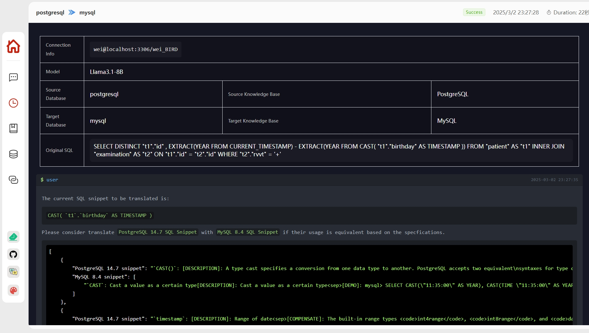

# CrackSQL

<p align="center">
  <b>📄 解锁无缝SQL方言转换 – 轻松、精确、高效~ 🐬</b>
</p>

<div align="center">
  
  <a></a>
  <a></a>
  <a></a>
  <a></a>

</div>

<p align="center">
  <a href="#-演示">演示</a> •
  <a href="#-快速开始">快速开始</a> •
  <a href="#-功能扩展">功能扩展</a> • 
  <a href="#-常见问题">常见问题</a> •  
  <a href="#-社区">社区</a> •  
  <a href="#-贡献者">贡献者</a> •  
  <a href="#-许可证">许可证</a>
</p>

<p align="center">
  <a href="./README.md">English</a> | <b>简体中文</b>
</p>

<p align="center">
  <b>点亮星标 ⭐ 并订阅 🔔 获取最新功能和改进！</b>
</p>

## ✨ 项目介绍

CrackSQL是一款强大的SQL方言转换工具，集成了基于规则的策略和大语言模型，以实现高精度的转换。它支持不同SQL方言之间的无缝转换（如PostgreSQL到MySQL），并提供Python API、命令行和Web界面等多种灵活访问方式。

> - **2025年3月:** 我们重构了代码并在多个开源平台上发布了我们的项目（[PyPI](https://pypi.org/project/cracksql/0.0.0b0/)）。我们目前正在开发[新功能](#待办事项)，欢迎更多贡献者加入！:wave: 👫
> - **2025年2月:** 我们的论文"*Cracking SQL Barrier: An LLM-based Dialect Translation System*"已被SIGMOD 2025接收！:tada: :tada: :tada:

## 📚 功能特点

- 🚀 **广泛的方言兼容性**：轻松在PostgreSQL、MySQL和Oracle之间进行转换，采用灵活的定制策略。
- 🎯 **精确度与高级处理**：通过面向功能的查询处理和尖端模型语法匹配，实现完美转换，采用自适应的从局部到全局迭代策略。
- 🔄 **多样化访问与集成**：通过Python API、命令行和Web界面，满足所有用户需求的无缝集成。

目前，CrackSQL集成了三种方言转换模式，采用[SQLGlot](https://sqlglot.com/sqlglot.html)的规则，并支持多种大语言模型(LLMs)，
包括流行的[GPT](https://openai.com/api/)系列以及最新的[DeepSeek](https://huggingface.co/deepseek-ai/DeepSeek-R1)模型。

<table><thead>
  <tr>
    <th rowspan="2">模式</th>
    <th rowspan="2">SQL方言</th>
    <th colspan="2">大语言模型<br>(未微调与微调)</th>
    <th colspan="2">嵌入模型<br>(未微调与微调)</th>
  </tr>
  <tr>
    <th>云服务<br>(例如，<a href="https://openai.com/api/" target="_blank" rel="noopener noreferrer">💬 GPT系列</a>)</th>
    <th>本地部署<br>(例如，<a href="https://huggingface.co/" target="_blank" rel="noopener noreferrer">🤗 Hugging Face</a>)</th>
    <th>云服务<br>(例如，<a href="https://openai.com/api/" target="_blank" rel="noopener noreferrer">💬 GPT系列</a>)</th>
    <th>本地部署<br>(例如，<a href="https://huggingface.co/" target="_blank" rel="noopener noreferrer">🤗 Hugging Face</a>)</th>
  </tr></thead>
<tbody>
  <tr>
    <td>仅规则</td>
    <td>24</td>
    <td>-</td>
    <td>-</td>
    <td>-</td>
    <td>-</td>
  </tr>
  <tr>
    <td>LLM直接</td>
    <td>✅</td>
    <td>✅</td>
    <td>✅</td>
    <td>-</td>
    <td>-</td>
  </tr>
  <tr>
    <td>规则+LLM</td>
    <td>3<br>(pg/mysql/oracle)</td>
    <td>✅</td>
    <td>✅</td>
    <td>✅</td>
    <td>✅</td>
  </tr>
</tbody></table>

此外，每种模式的先决条件如下所示，其中[*SQL解析器 (ANTLR)*](./backend/preprocessor/antlr_parser)和[*方言规范*](./data/processed_document)已经提供。
请参考[*功能扩展*](#功能扩展)部分来定制和增强CrackSQL，使其在您自己的案例中更加强大。

<table><thead>
  <tr>
    <th rowspan="2">模式</th>
    <th colspan="3">SQL方言</th>
    <th colspan="2">模型服务</th>
  </tr>
  <tr>
    <th>SQL解析器</th>
    <th>方言规范</th>
    <th>数据库连接</th>
    <th>大语言模型</th>
    <th>嵌入模型</th>
  </tr></thead>
<tbody>
  <tr>
    <td>仅规则</td>
    <td>✅<br>(SQLGlot)</td>
    <td>-</td>
    <td>-</td>
    <td>-</td>
    <td>-</td>
  </tr>
  <tr>
    <td>LLM直接</td>
    <td>-</td>
    <td>-</td>
    <td>-</td>
    <td>✅</td>
    <td>-</td>
  </tr>
  <tr>
    <td>规则+LLM</td>
    <td>✅<br>(ANTLR)</td>
    <td>✅</td>
    <td>✅ / -</td>
    <td>✅</td>
    <td>✅ / -</td>
  </tr>
</tbody>
</table>

## 📊 性能表现

下表展示了不同方法在我们收集的[基准测试](./data)上的转换准确率(%)（N/A表示Ora2Pg不支持该方言转换）。
- (1) $Acc_{EX}$ 表示转换后的SQL在语法上正确并且可在目标数据库上执行。
- (2) $Acc_{RES}$ 表示转换后的SQL与原始SQL提供完全相同的结果（包括显示顺序）。

请注意，所需的转换时间高度依赖于SQL复杂度（例如，需要转换的SQL语法片段数量），可能从几秒到几分钟不等。

|      **方法**      | **PG → MySQL** | **PG → MySQL** | **MySQL → PG** | **MySQL → PG** | **PG → Oracle** | **PG → Oracle** |
|--------------------|:--------------:|:--------------:|:--------------:|:--------------:|:-------------:|:-------------:|
|                      |   $Acc_{EX}$   |   $Acc_{RES}$  |   $Acc_{EX}$   |   $Acc_{RES}$  |   $Acc_{EX}$  |  $Acc_{RES}$  |
| **SQLGlot**          |      74.19     |      70.97     |      60.32     |      60.32     |     55.81     |     53.49     |
| **jOOQ**             |      70.97     |      70.97     |      39.68     |      39.68     |     62.79     |     60.47     |
| **Ora2Pg**           |       N/A      |       N/A      |      33.33     |      33.33     |      N/A      |      N/A      |
| **SQLines**          |      9.68      |      9.68      |      31.75     |      31.75     |     53.49     |     48.84     |
| **GPT-4o**           |      61.29     |      61.29     |      50.79     |      44.44     |     60.47     |     55.81     |
| **CrackSQL (我们的方法)** |      87.1      |      74.19     |      85.71     |      79.37     |     69.77     |     67.44     |

## 🖥️ 演示

以下展示了CrackSQL界面服务的主要页面，包括服务指导首页和详细转换过程。

- 已部署的转换服务首页：


- 特定转换对的详细转换过程：



## 🕹 快速开始

我们目前提供了两种方法（即PyPI包和源代码安装）来部署CrackSQL。

### 方法一：PyPI包安装

1. 在[官方网站](https://pypi.org/project/cracksql/0.0.0b0/)安装PyPI包。


```
# 创建虚拟环境
conda create -n CrackSQL python=3.10
conda activate CrackSQL

# 安装PyPI包
pip install cracksql==0.0.0b0
```

2. 使用PyPI包运行。以下是使用此包的运行代码示例：

```python

from cracksql.cracksql import translate, initkb

def initkb_func():
    try:
        initkb("./init_config.yaml")  # 首先在`.yaml`中填写基本配置
        print("Knowledge base initialized successfully")
    except Exception as e:
        print(f"Knowledge base initialization failed: {str(e)}")
        import traceback
        traceback.print_exc()


def trans_func():
    target_db_config = {
        "host": "目标数据库主机",
        "port": 目标数据库端口号（整数类型）,
        "user": "目标数据库用户名",
        "password": "目标数据库密码",
        "db_name": "目标数据库数据库名"
    }

    vector_config = {
        "src_kb_name": "源数据库知识库名称",
        "tgt_kb_name": "目标数据库知识库名称"
    }

    try:
        print("Starting SQL translation...")
        translated_sql, model_ans_list, used_pieces, lift_histories = translate(
            model_name="DeepSeek-R1-Distill-Qwen-32B", 
            src_sql='SELECT DISTINCT "t1"."id" , EXTRACT(YEAR FROM CURRENT_TIMESTAMP) - EXTRACT(YEAR FROM CAST( "t1"."birthday" AS TIMESTAMP )) FROM "patient" AS "t1" INNER JOIN "examination" AS "t2" ON "t1"."id" = "t2"."id" WHERE "t2"."rvvt" = "+"',
            src_dialect="postgresql",
            tgt_dialect="mysql",
            target_db_config=target_db_config,
            vector_config=vector_config,
            out_dir="./", 
            retrieval_on=False, 
            top_k=3
        )

        print("Translation completed!")
        print(f"Translated SQL: {translated_sql}")
        print(f"Model answer list: {model_ans_list}")
        print(f"Used knowledge pieces: {used_pieces}")
        print(f"Lift histories: {lift_histories}")
    except Exception as e:
        print(f"Error occurred during translation: {str(e)}")
        import traceback
        traceback.print_exc()


if __name__ == "__main__":

    initkb_func()
    trans_func()

```

### 方法二：源代码安装

#### 1. 克隆仓库

```bash
git clone https://github.com/weAIDB/CrackSQL.git
```

#### 2. 使用前端和后端应用

```bash
# 启动后端
cd CrackSQL/backend

# 安装依赖
conda create -n CrackSQL python=3.10
conda activate CrackSQL
pip install -r requirements.txt

# 初始化数据库
flask db init      # 初始化
flask db migrate   # 生成版本文件
flask db upgrade   # 同步到数据库

# 初始化知识库（可选，也可以在启动前端项目后在前端手动完成）
# 1. 首先将config/init_config.yaml.copy重命名为config/init_config.yaml
# 2. 修改config/init_config.yaml中的相关信息。如果要初始化知识库，需要Embedding Model
python init_knowledge_base.py  --config_file xxxxxxxxx

# 启动后端服务（后端服务端口也可以在app.py中修改，目前为30006）
python app.py

# 新开一个终端，启动前端（需要nodejs，版本20.11.1+）
cd CrackSQL/webui

# 安装依赖
pnpm install

# 启动开发服务器
pnpm run dev

# 访问http://localhost:50212使用Web界面

# 提示：
# 如果要修改前端端口号，可以在webui/vite.config.js中修改：port: 50212
# 如果后端API端口号已更改，或者要使用服务器的IP，可以修改webui/.env.serve-dev文件中的VITE_APP_BASE_URL参数（如果该文件不存在，可以将webui/.env.serve-dev_template重命名为.env.serve-dev）。
```

#### 3. 命令行使用

```bash
# 初始化知识库（可选，也可以在启动前端项目后在前端手动完成）
# 1. 首先将config/init_config.yaml.copy重命名为config/init_config.yaml
# 2. 修改config/init_config.yaml中的相关信息。如果要初始化知识库，需要Embedding Model
python init_knowledge_base.py --init_all

# 转换
# 通过`--help`命令指定所需的配置
python translate.py --help
```

## 📎 功能扩展

### 📄 补充额外语法和规范

#### 1. 额外语法

要补充额外语法，您可以根据以下语法规则修改ANTLR中的`.g4`文件。
在此语法中，每个解析规则都是递归结构的，由非终端和终端标记组成。
准备好`.g4`文件后，您可以使用[官方ANTLR工具](https://github.com/antlr/antlr4/blob/master/doc/python-target.md)生成更新的Python解析器，以集成到[CrackSQL](./backend/preprocessor/antlr_parser)中。

```antlrv4
sql_script
    : sql_plus_command_no_semicolon? (
        (sql_plus_command | unit_statement) (SEMICOLON '/'? (sql_plus_command | unit_statement))* SEMICOLON? '/'?
    ) EOF
    ;
......
```

#### 2. 额外规范

要补充额外规范，您可以按以下格式将新规范附加到`.json`文件中。

```json
[
  {
    "keyword": "SQL代码片段，必填",
    "type": "函数/关键字/类型/运算符，必填",
    "tree": "由SQL解析器生成的语法树，必填",
    "description": "简短的使用描述，必填",
    "detail": "详细的使用说明，必填（如果没有则为空字符串）",
    "link": ["链接1", "链接2", "链接3"],
    "example": ["示例1", "示例2", "示例3"]
  },
  {
    ......
  }
]
```

### 🐬 添加新方言

使CrackSQL支持新方言需要两个关键组件：(1)方言语法解析器和(2)功能规范。

#### 1. 新语法解析器

您可以先查看[官方ANTLR仓库](https://github.com/antlr/grammars-v4/tree/master/sql)，看看是否已有所需的方言语法（即ANTLR `.g4`文件）。
如果需要的语法不存在，您需要编写相应的ANTLR语法文件来构建SQL语法解析器。
`.g4`文件准备好后，您可以使用[官方ANTLR工具](https://github.com/antlr/antlr4/blob/master/doc/python-target.md)生成更新的Python解析器。
然后可以将这个解析器集成到[CrackSQL](./backend/preprocessor/antlr_parser)中。

#### 2. 新方言规范

您需要将功能规范（例如[Oracle函数描述](https://docs.oracle.com/cd/E11882_01/server.112/e41084/functions.htm#SQLRF006)）转换为`.json`文件。
在此文件中，每个项目应按以下格式组织。

```json
[
  {
    "keyword": "SQL代码片段，必填",
    "type": "片段类型，四个选项之一：'(1)函数，或(2)关键字，或(3)类型，或(4)运算符'，必填",
    "tree": "由SQL解析器生成的语法树，必填",
    "description": "简短的使用描述，必填",
    "detail": "详细的使用说明，必填（如果没有则为空字符串）",
    "link": ["链接1", "链接2", "链接3"],
    "example": ["示例1", "示例2", "示例3"]
  },
  {
    ......
  }
]
```

## 🤔 常见问题

<details><summary><b>问：如何使CrackSQL支持额外语法或新方言？</b></summary>
<b>答：</b>
要支持额外语法，您需要修改ANTLR中的`.g4`文件，然后生成更新的Python解析器。
此外，您应该为新添加的语法提供相应的方言规范。

要支持新方言，需要两个关键组件（即方言语法解析器和功能规范）。
目前，语法解析器基于ANTLR语法创建，规范可以通过处理官方文档获得。

更详细的信息，请参考[*功能扩展*](#功能扩展)部分。
</details>

## 📋 待办事项

- **有效工具发布**：我们正在准备我们的基于MoE的跨方言嵌入模型，以供实际使用，并计划很快在Hugging Face上发布。
- **全面的方言支持**：我们将支持更多具有已准备好的语法解析器和功能规范的方言，这是一项长期工作，欢迎更多贡献者加入！
- **转换效率提升**：我们旨在将LLM发现的规则实现到规则系统中，从而减少LLM调用开销。

## 👫 社区

我们深深感谢我们的开发者团队、支持用户和尊敬的行业合作伙伴所贡献的宝贵努力。

<a href="https://enmotech.com/"></a>
<a href="https://www.bytedance.com/"></a>

## 📒 引用

如果您喜欢这个项目，请引用我们的论文：

```
@misc{zhou2025cracksql,
      title={Cracking SQL Barriers: An LLM-based Dialect Transaltion System}, 
      author={Wei Zhou, Yuyang Gao, Xuanhe Zhou, and Guoliang Li},
      year={2025},
      journal={Proc. {ACM} Manag. Data},
      volume={3},
      number={2},
}
```

## 📧 贡献者

<a href="https://github.com/code4DB/CrackSQL/network/dependencies">
  
</a>

## 📝 许可证

本项目采用MIT许可证 - 详情请参阅[LICENSE](LICENSE)文件

