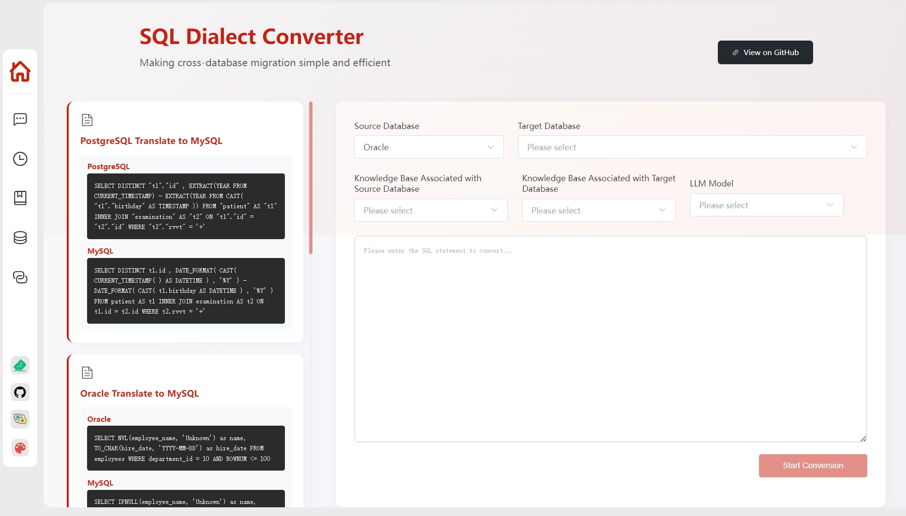
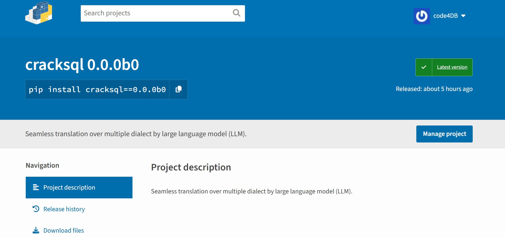

# CrackSQL

<p align="center">
  <b>一个强大的SQL方言转换工具，支持不同SQL方言之间的精确转换</b>
</p>

<p align="center">
  <a href="#-演示">演示</a> •
  <a href="#-快速开始">快速开始</a> •
  <a href="#-功能扩展">功能扩展</a> • 
  <a href="#-常见问题">常见问题</a> •  
  <a href="#-社区">社区</a> •  
  <a href="#-贡献者">贡献者</a> •  
  <a href="#-许可证">许可证</a>
</p>

<p align="center">
  <a href="./README.md">English</a> | <b>简体中文</b>
</p>

<p align="center">
  <b>点亮星标 ⭐ 并订阅 🔔 获取最新功能和改进！</b>
</p>

## ✨ 项目介绍

CrackSQL是一款专注于SQL方言转换的工具，支持不同SQL方言之间的精确转换（如PostgreSQL到MySQL）。它提供了三种使用方式：命令行、Python API和Web界面，满足不同场景的需求。

> - **2025年3月:** 我们重构了代码并在多个开源平台上发布了我们的项目（[PyPI](https://pypi.org/project/cracksql/0.0.0b0/)）。我们目前正在开发新功能，欢迎更多贡献者加入！:wave: 👫
> - **2025年2月:** 我们的论文"*Cracking SQL Barrier: An LLM-based Dialect Translation System*"已被SIGMOD 2025接收！:tada: :tada: :tada:

## 📚 功能特点

- 🚀 **多方言支持**：支持三种主流数据库方言之间的转换：PostgreSQL、MySQL和Oracle
- 🎯 **高精度转换**：基于三层转换架构，确保转换结果的准确性
- 🌟 **多种使用方式**：支持命令行、Python API和Web界面
- 🔍 **功能导向的语法处理**：将SQL语句分解为特定功能的语法元素
- 🧠 **基于模型的语法匹配**：使用创新的跨方言嵌入模型进行转换
- 🔄 **从局部到全局的转换策略**：灵活处理复杂的SQL转换场景

## 📊 性能表现

不同方法的转换准确率（%）（N/A表示Ora2Pg不支持该方言转换）。
请注意，转换开销高度依赖于SQL复杂度（例如，需要转换的SQL语法片段数量），可能从几秒到几分钟不等。

| **方法**                 | **PG → MySQL** | **MySQL → PG** | **PG → Oracle** | **Oracle → PG** | **MySQL → Oracle** | **Oracle → MySQL** |
|--------------------------------------------------|-----------------------------------------------------|-----------------------------------------------------|------------------------------------------------------|------------------------------------------------------|---------------------------------------------------------|---------------------------------------------------------|
|                                                  | **Acc_EX**                                 | **Acc_RES**                                | **Acc_EX**                                  | **Acc_RES**                                 | **Acc_EX**                                     | **Acc_RES**                                    | **Acc_EX** | **Acc_RES** | **Acc_EX** | **Acc_RES** | **Acc_EX** | **Acc_RES** |
| **SQLGlot**                  | 74.19                                               | 70.97                                               | 60.32                                                | 60.32                                                | 55.81                                                   | 53.49                                                   | 53.85               | 46.15                | 29.27               | 20.73                | 73.33               | 66.67                |
| **jOOQ**                          | 70.97                                               | 70.97                                               | 39.68                                                | 39.68                                                | 62.79                                                   | 60.47                                                   | 84.62               | 53.85                | 47.56               | 35.37                | 80.0                | 53.33                |
| **Ora2Pg** | N/A                                        | N/A                                        | 33.33                                     | 33.33                                     | N/A                                            | N/A                                            | 76.92    | 46.15     | N/A        | N/A         | N/A        | N/A         |
| **SQLines**                  | 9.68                                                | 9.68                                                | 31.75                                                | 31.75                                                | 53.49                                                   | 48.84                                                   | 61.54               | 38.46                | 39.02               | 32.93                | 80.0                | 60.0                 |
| **GPT-4o**                     | 61.29                                               | 61.29                                               | 50.79                                                | 44.44                                                | 60.47                                                   | 55.81                                                   | 84.62               | 53.85                | 12.2                | 10.98                | 80.0                | 73.33                |
| **CrackSQL (我们的方法)**                          | **87.1**                                       | **74.19**                                      | **85.71**                                       | **79.37**                                       | **69.77**                                          | **67.44**                                          | **92.31**      | **61.54**       | **59.76**      | **42.68**       | **93.33**       | **80.0**        |


## 🖥️ 演示

- 已部署的转换服务首页：



- 特定转换对的详细转换过程：


## 🚀 快速开始

### 方法一：PyPI包安装

在[官方网站](https://pypi.org/project/cracksql/0.0.0b0/)安装PyPI包。



```
# 创建虚拟环境
conda create -n CrackSQL python=3.10
conda activate CrackSQL

# 安装PyPI包
pip install cracksql==0.0.0b0
```

使用此PyPI包的示例代码如下：

```python

from cracksql.cracksql import translate, initkb

def initkb_func():
    try:
        initkb("./init_config.yaml")
        print("Knowledge base initialized successfully")
    except Exception as e:
        print(f"Knowledge base initialization failed: {str(e)}")
        import traceback
        traceback.print_exc()


def trans_func():

    target_db_config = {
        "host": "目标数据库主机",
        "port": 目标数据库端口号（整数类型）,
        "user": "目标数据库用户名",
        "password": "目标数据库密码",
        "db_name": "目标数据库名称"
    }

    vector_config = {
        "src_kb_name": "源数据库知识库名称",
        "tgt_kb_name": "目标数据库知识库名称"
    }

    try:
        print("Starting SQL translation...")
        translated_sql, model_ans_list, used_pieces, lift_histories = translate(
            model_name="DeepSeek-R1-Distill-Qwen-32B", 
            src_sql='SELECT DISTINCT "t1"."id" , EXTRACT(YEAR FROM CURRENT_TIMESTAMP) - EXTRACT(YEAR FROM CAST( "t1"."birthday" AS TIMESTAMP )) FROM "patient" AS "t1" INNER JOIN "examination" AS "t2" ON "t1"."id" = "t2"."id" WHERE "t2"."rvvt" = "+"',
            src_dialect="postgresql",
            tgt_dialect="mysql",
            target_db_config=target_db_config,
            vector_config=vector_config,
            out_dir="./", 
            retrieval_on=False, 
            top_k=3
        )

        print("Translation completed!")
        print(f"Translated SQL: {translated_sql}")
        print(f"Model answer list: {model_ans_list}")
        print(f"Used knowledge pieces: {used_pieces}")
        print(f"Lift histories: {lift_histories}")
    except Exception as e:
        print(f"Error occurred during translation: {str(e)}")
        import traceback
        traceback.print_exc()


if __name__ == "__main__":

    initkb_func()
    trans_func()

```

### 方法二：源代码安装

#### 1. 克隆仓库

```bash
git clone https://github.com/weAIDB/CrackSQL.git
```

#### 2. 使用前端和后端应用

```bash
# 启动后端
cd CrackSQL/backend

# 安装依赖
conda create -n CrackSQL python=3.10
conda activate CrackSQL
pip install -r requirements.txt

# 初始化数据库
flask db init      # 初始化
flask db migrate   # 生成版本文件
flask db upgrade   # 同步到数据库

# 初始化知识库（可选，也可以在启动前端项目后在前端手动完成）
# 1. 首先将config/init_config.yaml.copy重命名为config/init_config.yaml
# 2. 修改config/init_config.yaml中的相关信息。如果要初始化知识库，需要Embedding Model
python3 init_knowledge_base.py --init_all

# 启动后端服务（后端服务端口也可以在app.py中修改，目前为30006）
python app.py

# 新开一个终端，启动前端（需要nodejs，版本20.11.1+）
cd CrackSQL/webui

# 安装依赖
yarn cache clean
yarn install

# 启动开发服务器
yarn dev

# 访问http://localhost:50212使用Web界面

# 提示：
# 如果要修改前端端口号，可以在webui/vite.config.js中修改：port: 50212
# 如果后端API端口号已更改，或者要使用服务器的IP，可以修改webui/.env.serve-dev文件中的VITE_APP_BASE_URL参数（如果该文件不存在，可以将webui/.env.serve-dev_copy重命名为.env.serve-dev）。
```

#### 3. 命令行使用

```bash
# 初始化知识库（可选，也可以在启动前端项目后在前端手动完成）
# 1. 首先将config/init_config.yaml.copy重命名为config/init_config.yaml
# 2. 修改config/init_config.yaml中的相关信息。如果要初始化知识库，需要Embedding Model
python init_knowledge_base.py --init_all

# 转换
python translate.py --src_dialect "源方言"
```


## 📎 功能扩展

### 添加新语法

<i>待补充</i>

### 添加新数据库

<i>从头开始</i>

### 微调向量模型

<i>待补充</i>

## 🤔 常见问题

<i>待添加：常见问题</i>

## 📋 待办事项

- Python API

## 👫 社区

欢迎扫描二维码加入微信群！

<p align="center">
  <i>待添加：微信群二维码</i>
</p>

## 📒 引用

如果您喜欢这个项目，请引用我们的论文：

```
@misc{zhou2025cracksql,
      title={Cracking SQL Barriers: An LLM-based Dialect Transaltion System}, 
      author={Wei Zhou, Yuyang Gao, Xuanhe Zhou, and Guoliang Li},
      year={2025},
      journal={Proc. {ACM} Manag. Data},
      volume={3},
      number={2},
}
```

## 📧 贡献者

<a href="https://github.com/code4DB/CrackSQL/network/dependencies">
  
</a>

## 📝 许可证

<i>待添加：开源许可证</i>

本项目采用MIT许可证 - 详情请参阅[LICENSE](LICENSE)文件

